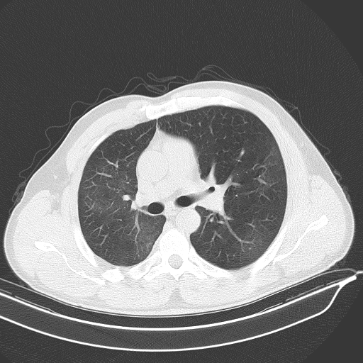
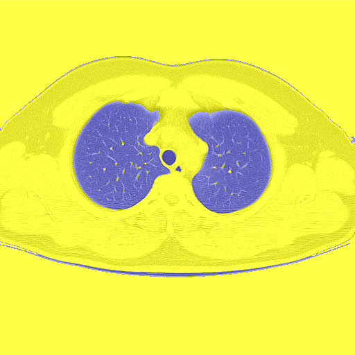
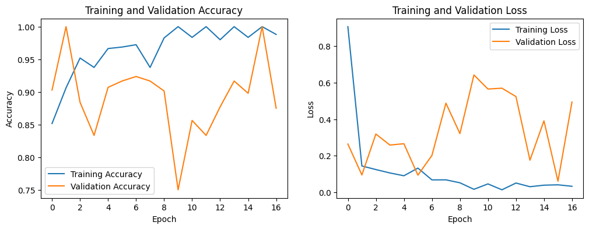

📈 Model Accuracy
🫁 Lung Segmentation Example

📄 Pneumonia Detection using Deep CNN Algorithms
Authors:

Bommareddy Lokesh

Lakshman Rohith Sanagapalli

Harshitha Koppolu

Institution: VIT-AP University

🏥 Project Overview
This project aims to automate the detection of pneumonia from CT scan images using Deep Convolutional Neural Networks (CNNs).
We combine the power of U-Net segmentation, ResNet152V2, VGG19, and Grad-CAM to deliver a high-accuracy classification model.
We specifically classify CT scans into two categories:

Disease (COVID-19 + Pneumonia)

Normal

📚 Dataset
Source: Kaggle Dataset - COVID19/Normal/Pneumonia CT Images

Classes Merged: COVID-19 and Pneumonia merged as "Disease"

Total Images: 7544

Disease: 5425 images

Normal: 2119 images

🏗️ Methodology
🔹 Data Preprocessing
Image resizing to (512, 512, 3)

Train-Validation-Test Split (70-15-15)

📷 Preprocessing Example:

🔹 Segmentation
U-Net architecture to isolate lung regions

Removal of background noise

🫁 Lung Segmentation Example:

🔹 Feature Extraction
Using Grad-CAM to highlight important lung regions

Weighted focus on diseased areas

📷 Grad-CAM Visualization:

🔹 Model Architecture
ResNet152V2 (pretrained on ImageNet)

VGG19 (for feature extraction and comparison)

Dropout layers (0.5 rate) to avoid overfitting

Adam optimizer, learning rate 0.0001

20 epochs

📷 Model Architecture Diagram:

🔹 Testing & Evaluation
Confusion Matrix

ROC AUC, Precision, Recall, F1 Score

📊 Results

Metric	Value
Training Accuracy	99.09%
Validation Accuracy	90.56%
Test Precision	96.28%
Test Recall	96.66%
Test F1 Score	94.71%
ROC AUC Score	99.76%
✅ Model successfully distinguishes between Disease and Normal CT scans with high robustness.

📷 Training/Validation Graphs:

📈 Model Visualization
Grad-CAM used for heatmaps to visualize lung infection areas.
Plotted Training/Validation Accuracy and Loss graphs for better model evaluation.

📌 Future Work
Explore lightweight architectures (e.g., EfficientNet, MobileNetV3) to reduce training time.

Incorporate clinical metadata along with imaging for multi-modal diagnosis.

Enhance segmentation by using attention-based U-Nets.

Larger, more diverse datasets for better generalization.
